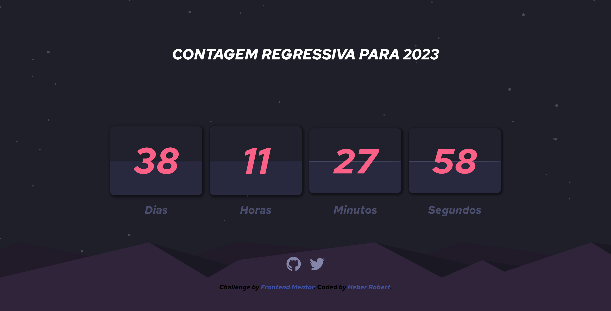

<h1 align="center">Contagem regressiva para o ano novo</h1>

  <a href="#-tecnologias">Tecnologias</a>&nbsp;&nbsp;&nbsp;|&nbsp;&nbsp;&nbsp;
  <a href="#-projeto">Projeto</a>

 

   

## 🚀 Tecnologias

Esse projeto foi desenvolvido com as seguintes tecnologias:

- HTML e CSS
- JavaScript
- Git e Github

## 💻 Projeto

  A contagem regressiva para o ano novo é um projeto com o intuíto de praticar com datas no javascript. O desafio foi tirado do site [Frontend Mentor](https://www.frontendmentor.io/challenges/launch-countdown-timer-N0XkGfyz-) e foi feito apenas algumas alterações quanto a contagem regressiva, que não estava relacionada à chegada do ano novo. 
